# Blood Bank Project
A Blood Bank is a facility where blood is collected, processed, stored, 
and distributed for transfusion to patients in need.

## Screenshots

## Login

## Registeration
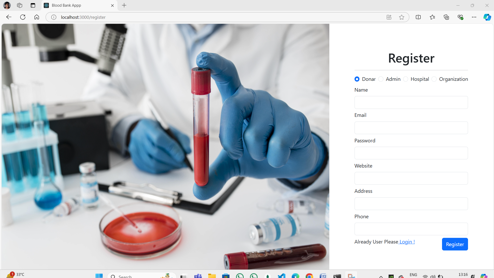

## Spinner
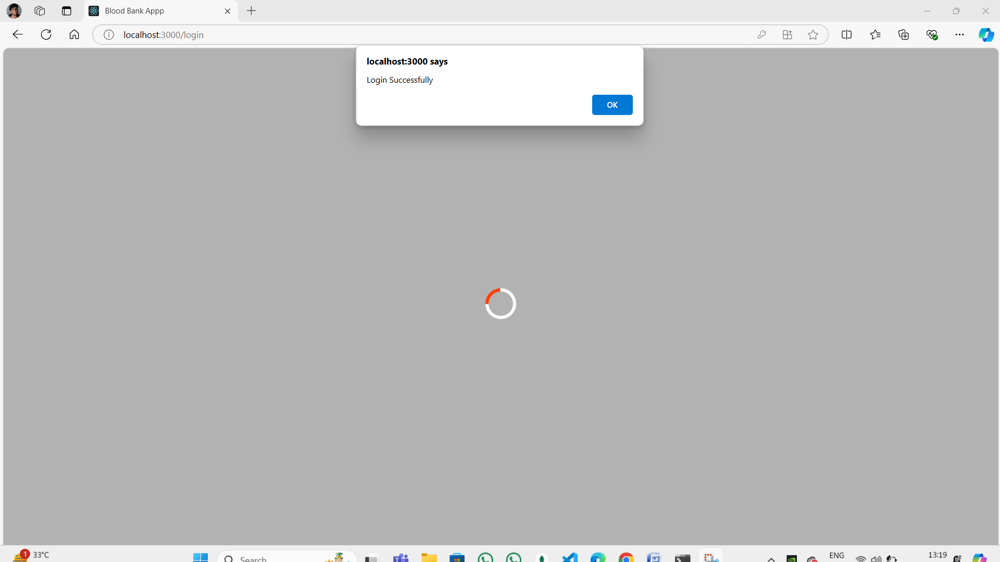

## Admin Control
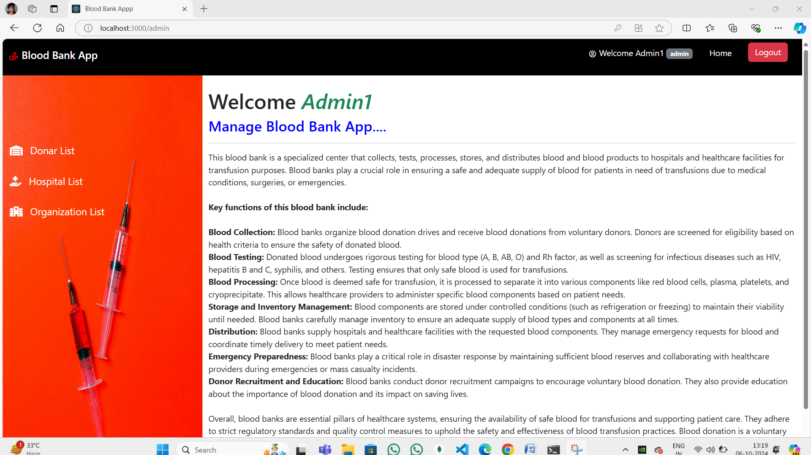

## Admin can manage donar
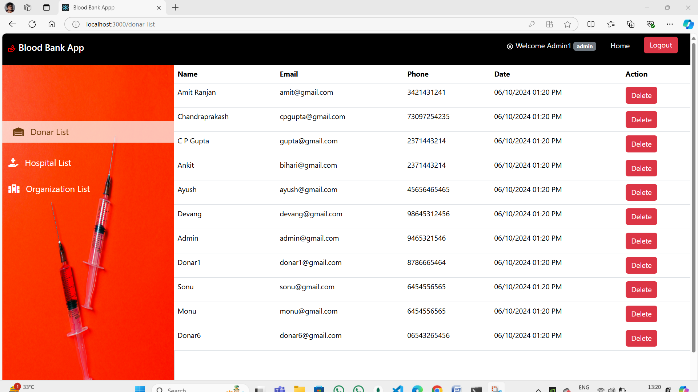

## Admin can manage hospital
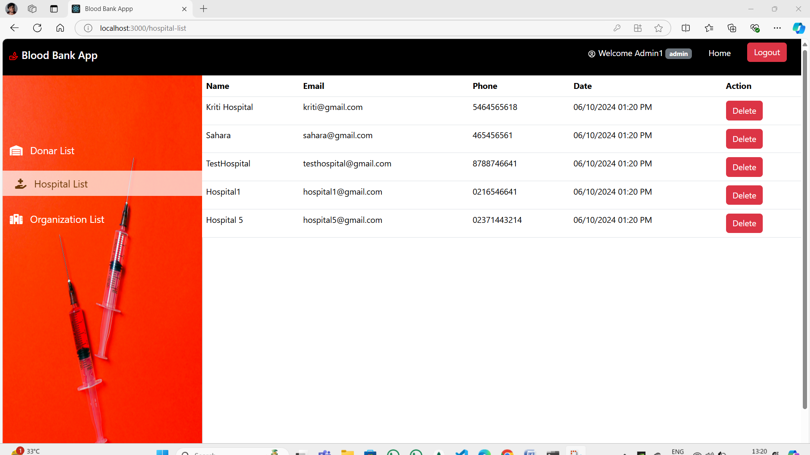

## Admin can manage organization
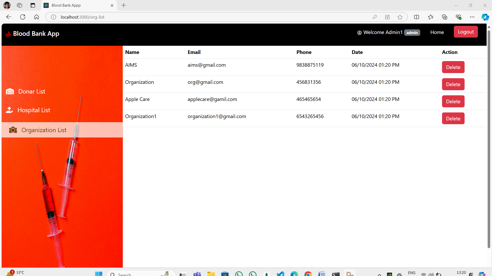

## Action on any event
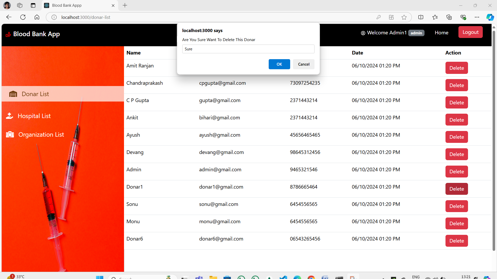

## Successful message for any event
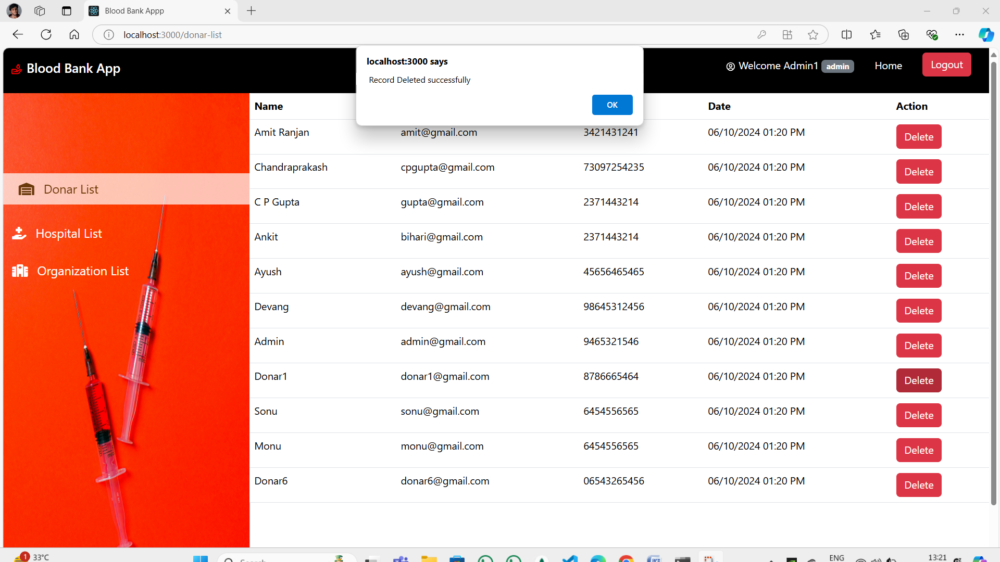

## Logout
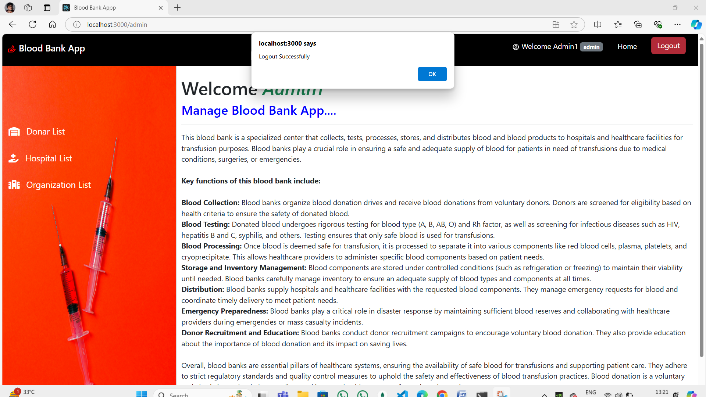

## Hospital Control
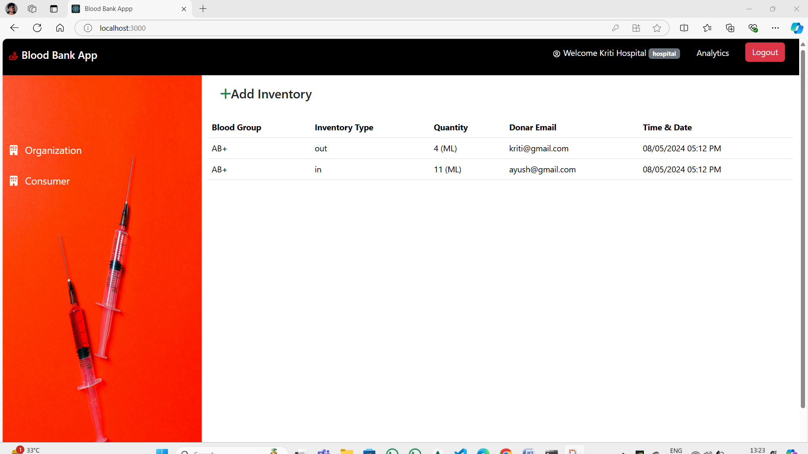

## Analytics
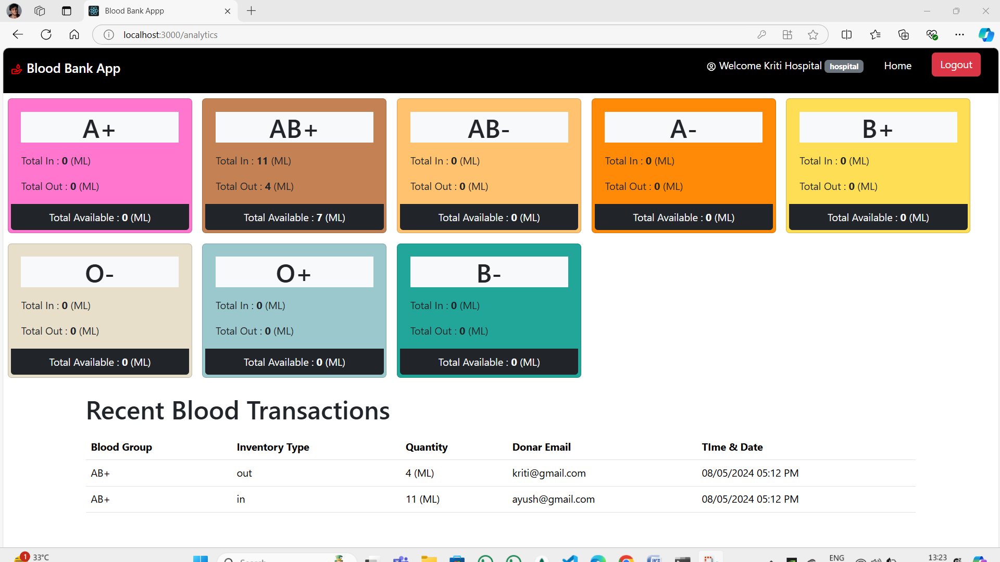

## Inventory management
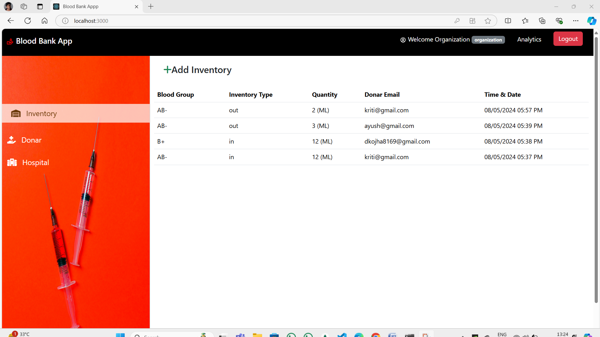

## Consumer
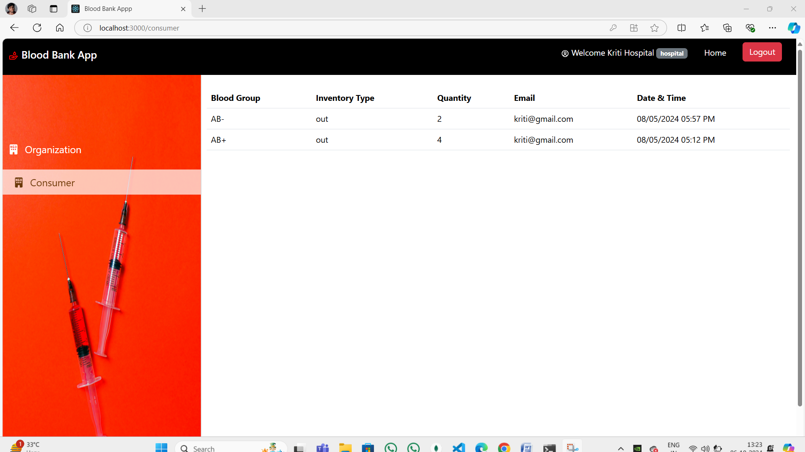

### Description 
    This project is a blood bank management system built using the MERN stack.
    It has 4 types of roles. They include : 
        1) Donar
        2) Admin
        3) Hospital
        4) Organizaiton
        
#### Features
    Registration and Login according to role (Donar, Admin, hospital, Organizaiton)
    Admin control
    Inventory management (With blood-group, blood-quantity)

##### Database Connection
    Used database collection as : blood-bank -> 1) inventories 2) users

###### Steps to run project
    1) Connect "Mondodb" database 
    2) run command "node server.js" (be sure you are in server's path)
    3) run command "npm start" (be sure you are in "client" path)

    